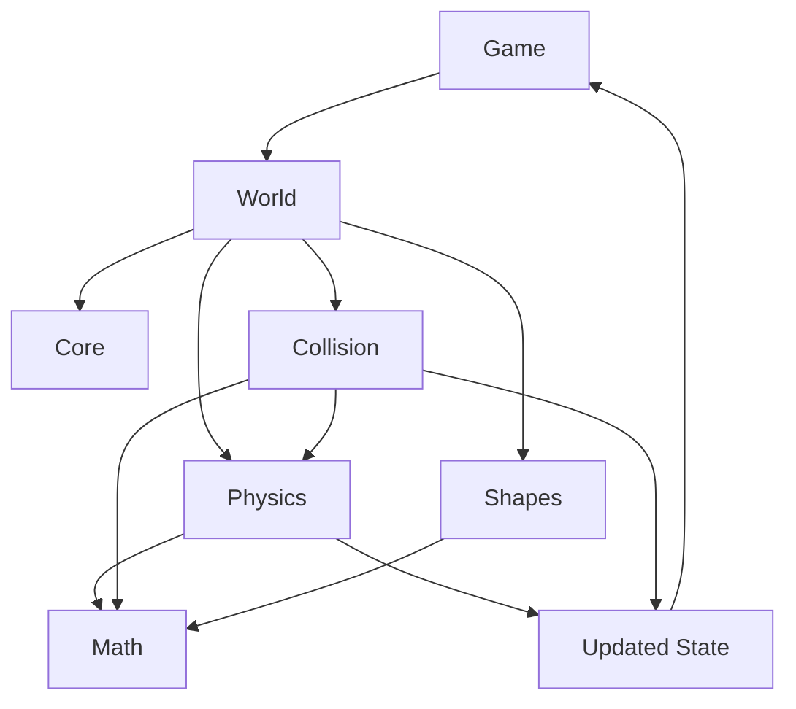
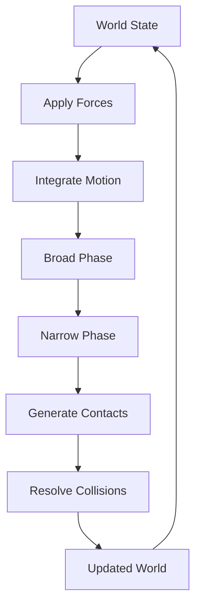
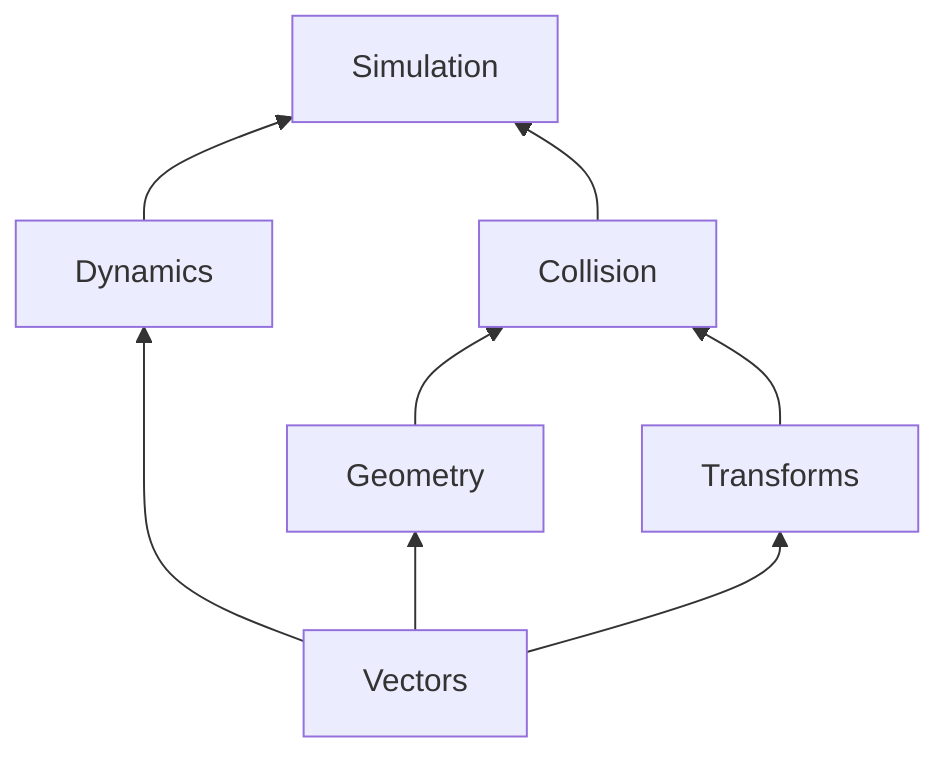

# C-Verse Architecture

> A lightweight 2D rigid-body physics engine built from scratch in C++.

---

## `> 1. Overview`

C-Verse is a physics simulation library designed for indie game developers.

Its responsibility is simple:

**Given the state of a physical world at time `t`, calculate its state at time `t + Δt`.**

C-Verse does not render anything, manage game assets, or define how a game should be structured.

It provides the physical simulation underneath the game.

```text
                         GAME
                           │
                           │
                    creates / controls
                           │
                           ▼
                  ┌─────────────────┐
                  │     C-VERSE     │
                  │      WORLD      │
                  └────────┬────────┘
                           │
             ┌─────────────┼─────────────┐
             │             │             │
             ▼             ▼             ▼
          BODIES        SHAPES        FORCES
             │             │             │
             └─────────────┼─────────────┘
                           │
                           ▼
                     SIMULATION
                           │
              ┌────────────┴────────────┐
              ▼                         ▼
         COLLISION                  DYNAMICS
         DETECTION                  & MOTION
              │                         │
              └────────────┬────────────┘
                           ▼
                     UPDATED STATE
                           │
                           ▼
                          GAME
```

The engine is intentionally separated from rendering.

C-Verse knows that a body exists at `(10, 4)`.

It does not care whether the game draws that body as a crate, a spaceship, or a suspiciously detailed potato.

---

## `> 2. Design Goals`

C-Verse is built around four primary goals.

### Lightweight

The engine should remain small enough to embed into an indie game without dragging an entire ecosystem along with it.

### Understandable

The implementation should be readable and educational.

Physics engines are full of interesting mathematics and numerical problems. C-Verse should make those problems visible rather than burying them under layers of abstraction.

### Modular

The major systems should have clear responsibilities and minimal coupling.

```text
┌──────────────┐
│     CORE     │
└──────┬───────┘
       │
       ├──────────────┐
       ▼              ▼
    PHYSICS         WORLD
       │              │
       ├──────┐       │
       ▼      ▼       │
    SHAPES  COLLISION │
       │      │       │
       └──────┴───────┘
              │
              ▼
             MATH
```

### Game-oriented

C-Verse is ultimately a game physics engine.

Mathematical correctness matters, but so do predictable behaviour, a sensible API, and practical performance.

---

## `> 3. High-Level Architecture`

The engine is divided into five major systems.



### Core

Responsible for the infrastructure that holds the simulation together.

```text
core/
├── world
├── simulation
├── configuration
└── engine state
```

Core should answer questions such as:

* What world is being simulated?
* What bodies belong to that world?
* What is the simulation timestep?
* What configuration does the engine use?

It should not contain the mathematics of collision detection or rigid-body dynamics.

---

### Math

The mathematical foundation of the engine.

```text
math/
├── vectors
├── matrices
├── transforms
├── geometry
└── numerical utilities
```

Everything else depends on this layer.

The math system should remain independent of the physics world wherever possible.

---

### Physics

Responsible for physical bodies and their motion.

```text
physics/
├── bodies
├── velocity
├── acceleration
├── forces
├── mass
├── inertia
└── integration
```

This is where C-Verse turns forces into changes in motion.

---

### Shapes

Defines the geometric representation of physical objects.

```text
shapes/
├── circle
├── box
├── polygon
└── shape utilities
```

A body describes physical properties.

A shape describes geometry.

Keeping these concepts separate allows the same physical machinery to operate on different kinds of geometry.

---

### Collision

Responsible for determining when objects interact and calculating the information required to resolve those interactions.

```text
collision/
├── broad phase
├── narrow phase
├── contact generation
├── collision detection
└── collision response
```

Collision detection answers:

```text
"Are these objects touching?"
```

Collision resolution answers:

```text
"What should happen because they are touching?"
```

Those are related problems, but they are not the same problem.

---

## `> 4. Simulation Pipeline`

Each simulation step follows a defined sequence.

```text
                 ┌───────────────┐
                 │  WORLD STATE  │
                 └───────┬───────┘
                         │
                         ▼
                 ┌───────────────┐
                 │ APPLY FORCES  │
                 └───────┬───────┘
                         │
                         ▼
                 ┌───────────────┐
                 │   INTEGRATE   │
                 │     MOTION    │
                 └───────┬───────┘
                         │
                         ▼
                 ┌───────────────┐
                 │ BROAD PHASE   │
                 └───────┬───────┘
                         │
                         ▼
                 ┌───────────────┐
                 │ NARROW PHASE  │
                 └───────┬───────┘
                         │
                         ▼
                 ┌───────────────┐
                 │    CONTACT    │
                 │   GENERATION  │
                 └───────┬───────┘
                         │
                         ▼
                 ┌───────────────┐
                 │    COLLISION  │
                 │   RESOLUTION  │
                 └───────┬───────┘
                         │
                         ▼
                 ┌───────────────┐
                 │ UPDATED WORLD │
                 └───────┬───────┘
                         │
                         └──────────► NEXT STEP
```

The corresponding flow is:



The simulation runs this pipeline once for every physics timestep.

---

## `> 5. World`

The `World` is the central container for the simulation.

Conceptually:

```text
WORLD
│
├── Gravity
│
├── Bodies
│   ├── Body A
│   ├── Body B
│   ├── Body C
│   └── ...
│
├── Shapes
│
└── Simulation State
```

A game creates a world and populates it with physical bodies.

The world then advances the simulation.

```text
world.step(delta_time);
```

The exact API may change as development progresses, but the conceptual responsibility remains the same.

---

## `> 6. Bodies`

A body represents an object participating in the physical simulation.

A body contains physical state such as:

```text
BODY
│
├── Position
├── Rotation
├── Linear Velocity
├── Angular Velocity
├── Mass
├── Inertia
├── Force
├── Torque
└── Shape
```

Bodies can eventually be divided into categories such as:

```text
STATIC
DYNAMIC
KINEMATIC
```

The first implementation does not need every category immediately.

The architecture should, however, leave room for them.

---

## `> 7. Shapes`

Geometry and physical state are intentionally separate.

```text
             BODY
              │
       ┌──────┴──────┐
       │             │
   PHYSICAL       GEOMETRIC
     STATE           STATE
       │             │
       ▼             ▼
   mass, force     circle
   velocity        box
   position        polygon
```

This separation allows collision algorithms to operate on geometry without needing to know everything about the object containing it.

---

## `> 8. Collision System`

Collision detection is divided into two conceptual stages.

```text
ALL OBJECT PAIRS
       │
       ▼
┌───────────────┐
│  BROAD PHASE  │
└───────┬───────┘
        │
        │ possible collisions
        ▼
┌───────────────┐
│  NARROW PHASE │
└───────┬───────┘
        │
        │ actual collision
        ▼
   CONTACT DATA
```

The broad phase eliminates pairs that cannot possibly collide.

The narrow phase performs the more expensive geometric tests on the remaining candidates.

This separation becomes increasingly important as the number of bodies increases.

---

## `> 9. Collision Response`

Detecting a collision is only half the problem.

Suppose two bodies intersect:

```text
      ┌───────┐
      │       │
      │   A   │
      │     ┌─┼─────┐
      └─────┼─┘     │
            │   B   │
            └───────┘
```

The engine must determine how the bodies should respond.

This can involve:

* penetration correction
* impulses
* restitution
* friction
* linear velocity changes
* angular velocity changes

Eventually, the collision system should produce enough information for the physics system to update the bodies consistently.

---

## `> 10. Mathematics`

The mathematics layer sits underneath the simulation.



The mathematical documentation covers the theory behind these systems separately.

The important principle is:

**C-Verse should implement mathematical concepts directly rather than hiding them behind unnecessary abstractions.**

---

## `> 11. Data Flow`

At a high level, information moves through the engine like this:

```text
                INPUT
                  │
                  ▼
        ┌─────────────────┐
        │  WORLD / BODIES │
        └────────┬────────┘
                 │
                 ▼
            FORCES
                 │
                 ▼
           INTEGRATION
                 │
                 ▼
          BODY POSITIONS
          & VELOCITIES
                 │
                 ▼
        COLLISION DETECTION
                 │
                 ▼
           CONTACT DATA
                 │
                 ▼
       COLLISION RESOLUTION
                 │
                 ▼
          FINAL STATE
                 │
                 ▼
                GAME
```

The game provides initial conditions and external input.

C-Verse performs the simulation.

The game consumes the resulting state.

---

## `> 12. Dependency Direction`

Dependencies should generally flow downward toward more fundamental systems.

```text
        ┌─────────────┐
        │    CORE     │
        └──────┬──────┘
               │
       ┌───────┼───────┐
       ▼       ▼       ▼
   PHYSICS  COLLISION SHAPES
       │       │       │
       └───────┼───────┘
               ▼
            MATH
```

The math layer should not depend on the physics layer.

Shapes should not need to know about the world.

Collision detection should not need to know about rendering.

This keeps the engine modular and makes individual systems easier to test.

---

## `> 13. Architectural Principle`

C-Verse should follow one simple rule:

```text
             ┌─────────────────────────┐
             │       KEEP IT SMALL     │
             └────────────┬────────────┘
                          │
             ┌────────────┴────────────┐
             ▼                         ▼
       SIMPLE SYSTEMS            CLEAR MATH
             │                         │
             └────────────┬────────────┘
                          ▼
                    USEFUL ENGINE
```

The engine should not become complicated merely because physics is complicated.

Complexity should be introduced only when the simulation actually requires it.

The objective is not to hide the physics.

**The objective is to turn the physics into a usable piece of software.**