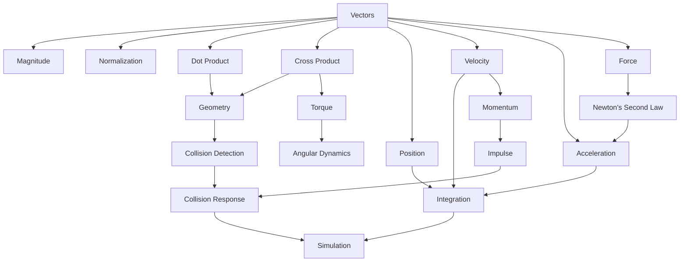

# C-Verse Mathematical Foundations

> The mathematics behind the simulation.

---

## `> 1. Why Mathematics?`

A physics engine is, at its core, a numerical simulation.

C-Verse does not simulate physics by knowing what a "real" object should do.

It calculates what an approximation of that object should do according to a mathematical model.

The basic loop is:

```text
        PHYSICAL STATE
              │
              ▼
        MATHEMATICAL MODEL
              │
              ▼
          CALCULATION
              │
              ▼
        UPDATED STATE
              │
              └───────────┐
                          │
                          ▼
                    NEXT TIMESTEP
```

The simulation therefore depends on a few mathematical foundations:

```text
Vectors
   │
   ├── Geometry
   │
   ├── Motion
   │
   └── Forces
          │
          ▼
      Dynamics
          │
          ├── Integration
          │
          └── Momentum
                 │
                 ▼
             Collisions
                 │
                 └── Impulses
```

This document introduces those foundations before they are implemented in C-Verse.

---

# `> 2. Coordinate Systems`

C-Verse uses a Cartesian coordinate system.

A point in 2D space is represented as:

[
p = (x, y)
]

Conceptually:

```text
                 +Y
                  │
                  │
                  │
                  │
        -X ──────┼────── +X
                  │
                  │
                  │
                  │
                 -Y
```

The origin is:

[
(0,0)
]

A position therefore describes where something exists in the world.

A vector, however, describes a quantity such as displacement, velocity, acceleration, or force.

Although both are represented using `(x, y)`, their meanings are different.

```text
POSITION
"Where am I?"

VECTOR
"Which direction, and how much?"
```

This distinction becomes important throughout the engine.

---

# `> 3. Vectors`

A 2D vector is represented as:

[
\vec{v} = (v_x, v_y)
]

In C-Verse, vectors will form the mathematical foundation of almost every system.

```text
               y
               │
               │        •
               │       /|
               │      / |
               │     /  | vy
               │    /   |
               │   /    |
               │  /     |
               │ /      |
               └────────────── x
                  vx
```

A vector has both magnitude and direction.

Common vectors in a physics engine include:

```text
position
velocity
acceleration
force
impulse
gravity
normal
```

---

# `> 4. Vector Addition`

Vectors can be added component by component.

Given:

[
\vec{a} = (a_x,a_y)
]

and

[
\vec{b} = (b_x,b_y)
]

then:

[
\vec{a}+\vec{b}
===============

(a_x+b_x,\ a_y+b_y)
]

Geometrically:

```text
        b
        ↗
       /
      /
     / 
    ●────────► a
     \
      \
       ↗
     a + b
```

Vector addition is used constantly in simulation.

For example, position changes according to velocity:

[
p_{new} = p_{old} + \Delta p
]

---

# `> 5. Scalar Multiplication`

A vector can be multiplied by a scalar.

[
\vec{v} = (v_x,v_y)
]

[
s\vec{v} = (sv_x,sv_y)
]

For example:

[
2(3,4)=(6,8)
]

This changes the magnitude of the vector without changing its direction.

In physics, scalar multiplication appears everywhere:

[
\Delta p = v\Delta t
]

and:

[
F = ma
]

---

# `> 6. Magnitude`

The magnitude of a vector is its length.

For:

[
\vec{v}=(x,y)
]

the magnitude is:

[
|\vec{v}| = \sqrt{x^2+y^2}
]

This comes directly from the Pythagorean theorem.

```text
          •
         /|
        / |
       /  | y
      /   |
     /____|
       x

length = √(x² + y²)
```

Magnitude is useful for:

* speed
* distance
* forces
* collision calculations
* normalization

---

# `> 7. Normalization`

A normalized vector has a magnitude of `1`.

Given:

[
\vec{v}=(x,y)
]

its normalized form is:

[
\hat{v} =
\frac{\vec{v}}{|\vec{v}|}
]

provided:

[
|\vec{v}| \neq 0
]

For example:

[
(3,4)
]

has magnitude:

[
5
]

Therefore:

[
\hat{v} =
\left(\frac35,\frac45\right)
]

Normalization preserves direction while removing magnitude.

This is especially important for collision normals.

---

# `> 8. Dot Product`

The dot product of two vectors is:

[
\vec{a}\cdot\vec{b}
===================

a_xb_x+a_yb_y
]

The result is a scalar.

The dot product can also be expressed as:

[
\vec{a}\cdot\vec{b}
===================

|\vec{a}||\vec{b}|\cos\theta
]

where `θ` is the angle between the vectors.

This makes the dot product useful for determining how aligned two vectors are.

```text
same direction:

──────►
──────►

dot > 0


perpendicular:

──────►
   │
   │
   ▼

dot = 0


opposite:

──────►
◄──────

dot < 0
```

C-Verse will use dot products for things such as:

* projections
* collision tests
* surface normals
* velocity decomposition
* determining whether objects are moving toward each other

---

# `> 9. 2D Cross Product`

In 2D, the cross product is represented by a scalar:

[
\vec{a}\times\vec{b}
====================

a_xb_y-a_yb_x
]

Unlike the dot product, the 2D cross product provides information about orientation.

```text
        b
        ↑
       /
      /
     ●────────► a

a × b < 0
```

Reversing the order changes the sign:

[
\vec{b}\times\vec{a}
====================

-(\vec{a}\times\vec{b})
]

Cross products are useful for:

* torque
* angular motion
* orientation tests
* geometric calculations
* collision detection

---

# `> 10. Distance`

The displacement between two points is:

[
\vec{d}=b-a
]

For:

[
a=(a_x,a_y)
]

and:

[
b=(b_x,b_y)
]

we get:

[
\vec{d}
=======

(b_x-a_x,\ b_y-a_y)
]

The distance is:

[
d=|\vec{d}|
]

or:

[
d=
\sqrt{(b_x-a_x)^2+(b_y-a_y)^2}
]

Distance calculations appear throughout collision detection.

---

# `> 11. Transformations`

A physical body has a position and orientation.

A transform describes how an object's local coordinates map into world coordinates.

Conceptually:

```text
LOCAL SPACE
    │
    │ rotation
    ▼
ROTATED SPACE
    │
    │ translation
    ▼
WORLD SPACE
```

A 2D transform can therefore be thought of as:

```text
Transform
│
├── Position
└── Rotation
```

For a point `p`, a transform can be represented conceptually as:

[
p_{world}=Rp_{local}+t
]

where:

* `R` is the rotation
* `t` is the translation

Transforms are particularly important for rotated shapes.

---

# `> 12. Rotation`

A 2D rotation by angle `θ` is represented by:

[
R(\theta)
=========

\begin{bmatrix}
\cos\theta & -\sin\theta\
\sin\theta & \cos\theta
\end{bmatrix}
]

Applying this matrix to a vector rotates it.

```text
              y
              │
          ↗   │
        ↗     │
      ↗       │
─────●──────────── x
```

Angles in C-Verse should be represented internally in radians.

A full rotation is:

[
2\pi
]

radians.

---

# `> 13. Time`

Physics simulation is performed over discrete timesteps.

Instead of continuously calculating reality, C-Verse calculates snapshots.

```text
t₀        t₁        t₂        t₃
│         │         │         │
●─────────●─────────●─────────●
     Δt        Δt        Δt
```

The timestep is:

[
\Delta t=t_{next}-t
]

A simulation therefore approximates continuous motion with a sequence of discrete updates.

The choice of timestep is important.

Large timesteps can cause instability.

Small timesteps increase computational cost.

---

# `> 14. Velocity`

Velocity describes how quickly position changes.

[
v=\frac{\Delta x}{\Delta t}
]

Rearranging:

[
\Delta x=v\Delta t
]

Therefore:

[
x_{new}=x_{old}+v\Delta t
]

Velocity contains both magnitude and direction.

The magnitude of velocity is speed:

[
speed=|v|
]

---

# `> 15. Acceleration`

Acceleration describes how velocity changes over time.

[
a=\frac{\Delta v}{\Delta t}
]

Therefore:

[
\Delta v=a\Delta t
]

and:

[
v_{new}=v_{old}+a\Delta t
]

Gravity is one example of acceleration.

For a world with downward gravity:

[
g=(0,-9.81)
]

---

# `> 16. Newton's Second Law`

The central equation of rigid-body dynamics is:

[
F=ma
]

Therefore:

[
a=\frac{F}{m}
]

This means a force changes an object's acceleration according to its mass.

```text
             FORCE
               │
               ▼
        ┌─────────────┐
        │   F = ma    │
        └──────┬──────┘
               │
       ┌───────┴───────┐
       ▼               ▼
  acceleration       mass
       │
       ▼
    velocity
       │
       ▼
    position
```

This relationship forms the basis of force-driven motion in C-Verse.

---

# `> 17. Gravity`

Gravity can be represented as a constant acceleration applied to bodies.

For example:

[
g=(0,-9.81)
]

The gravitational force on a body is:

[
F_g=mg
]

Substituting into Newton's second law:

[
a=\frac{mg}{m}
]

which gives:

[
a=g
]

Thus every body in the same gravitational field experiences the same acceleration regardless of mass, ignoring other forces.

---

# `> 18. Integration`

The engine must convert continuous physical equations into discrete numerical updates.

This process is called numerical integration.

The simplest form is Euler integration.

For velocity:

[
v_{t+\Delta t}
==============

v_t+a_t\Delta t
]

For position:

[
x_{t+\Delta t}
==============

x_t+v_t\Delta t
]

A commonly useful variation for physics engines is semi-implicit Euler:

[
v_{t+\Delta t}
==============

v_t+a_t\Delta t
]

followed by:

[
x_{t+\Delta t}
==============

x_t+v_{t+\Delta t}\Delta t
]

The order matters.

```text
FORCES
   │
   ▼
ACCELERATION
   │
   ▼
VELOCITY
   │
   ▼
POSITION
```

C-Verse can begin with a simple integrator and evolve toward more sophisticated numerical methods if required.

---

# `> 19. Momentum`

Linear momentum is:

[
p=mv
]

Momentum represents the quantity of motion carried by a body.

For two bodies:

[
p_1=m_1v_1
]

[
p_2=m_2v_2
]

The total momentum is:

[
p_{total}=p_1+p_2
]

Momentum becomes particularly important when handling collisions.

---

# `> 20. Impulse`

An impulse is a change in momentum.

[
J=\Delta p
]

Since:

[
p=mv
]

an impulse changes velocity:

[
J=m\Delta v
]

Therefore:

[
\Delta v=\frac{J}{m}
]

Conceptually:

```text
BEFORE COLLISION
       │
       ▼
   VELOCITY
       │
       │
    IMPULSE
       │
       ▼
   NEW VELOCITY
       │
       ▼
AFTER COLLISION
```

Impulse-based collision resolution allows C-Verse to change velocities without simulating the collision force over an extremely small period of time.

---

# `> 21. Collision Normals`

A collision normal describes the direction in which two surfaces are interacting.

```text
            B
       ┌─────────┐
       │         │
       │         │
       └────┬────┘
            │
            │ normal
            │
            ▼
       ─────────────
             A
```

A normal is typically normalized:

[
|\hat{n}|=1
]

Collision response can then use the normal to determine how velocity should change.

The normal separates the collision into components:

```text
VELOCITY
    │
    ├──────────► tangential
    │
    ▼
 normal
```

This distinction becomes important for restitution and friction.

---

# `> 22. Restitution`

Restitution describes how bouncy a collision is.

It is commonly represented by:

[
e
]

with typical values between:

[
0\le e\le1
]

Conceptually:

```text
e = 0

████████
   ↓
   █
   █
────────────
   █
────────────


e = 1

████████
   ↓
   █
   ↗
────────────
```

A restitution value of `0` represents a perfectly inelastic collision.

A value of `1` represents a perfectly elastic collision.

Real materials generally fall somewhere between these extremes.

---

# `> 23. Friction`

Friction acts along the contact surface.

If the collision normal is:

[
n
]

then a tangent vector can be constructed perpendicular to it.

```text
             normal
               ↑
               │
               │
───────────────┼──────────────
               └─────────────► tangent
```

The velocity of a body can be separated into:

[
v=v_n+v_t
]

where:

* `v_n` is the normal component
* `v_t` is the tangential component

Restitution primarily affects the normal component.

Friction primarily affects the tangential component.

This separation allows C-Verse to model surfaces that slide, resist sliding, or bounce.

---

# `> 24. Angular Motion`

Bodies can rotate as well as translate.

Angular position:

[
\theta
]

Angular velocity:

[
\omega=\frac{d\theta}{dt}
]

Angular acceleration:

[
\alpha=\frac{d\omega}{dt}
]

The discrete equivalents are:

[
\omega_{new}
============

\omega_{old}+\alpha\Delta t
]

and:

[
\theta_{new}
============

\theta_{old}+\omega_{new}\Delta t
]

This allows objects to spin.

```text
       ┌───────┐
       │       │
       │   ↻   │
       │       │
       └───────┘
```

---

# `> 25. Torque`

Torque is the rotational equivalent of force.

For a force `F` applied at a position `r` relative to the center of mass:

[
\tau=r\times F
]

In 2D:

[
\tau=r_xF_y-r_yF_x
]

Torque changes angular velocity.

The rotational equivalent of Newton's second law is:

[
\tau=I\alpha
]

where `I` is the moment of inertia.

Therefore:

[
\alpha=\frac{\tau}{I}
]

---

# `> 26. Moment of Inertia`

Mass describes resistance to linear acceleration.

Moment of inertia describes resistance to rotational acceleration.

```text
LINEAR

       F
       ↓
      ███
      ███
      ███

F = ma


ROTATIONAL

       ↻
      ███
      ███
      ███

τ = Iα
```

The moment of inertia depends on both mass and how that mass is distributed around the axis of rotation.

A compact object and a long object can have the same mass but different moments of inertia.

This matters when objects collide away from their center of mass.

---

# `> 27. Linear and Angular State`

A rigid body therefore has two major forms of motion.

```text
                 RIGID BODY
                     │
          ┌──────────┴──────────┐
          ▼                     ▼
       LINEAR                 ANGULAR
          │                     │
     ┌────┼────┐           ┌────┼────┐
     ▼    ▼    ▼           ▼    ▼    ▼
 position velocity force  angle velocity torque
          │                     │
          ▼                     ▼
        mass                inertia
```

Together they describe the body's physical state.

---

# `> 28. The Simulation Equation`

The complete simulation can be viewed as a state transition.

Let the state of the world be:

[
S_t
]

The physics engine computes:

[
S_{t+\Delta t}=F(S_t,\Delta t)
]

where `F` represents the complete simulation process.

Expanded:

```text
             S(t)
              │
              ▼
        external forces
              │
              ▼
          dynamics
              │
              ▼
          integration
              │
              ▼
         collision
              │
              ▼
          impulses
              │
              ▼
          S(t + Δt)
```

This is the fundamental job of C-Verse.

---

# `> 29. Numerical Reality`

The equations above describe an ideal mathematical system.

A computer does not operate on ideal mathematics.

It operates using:

```text
finite precision
finite timestep
finite memory
finite computation
```

Therefore, C-Verse is an approximation of a physical system.

This introduces problems such as:

* floating-point error
* numerical instability
* tunnelling
* accumulated error
* energy gain or loss
* jitter
* unstable constraints

A major part of physics-engine development is therefore not simply implementing equations.

It is keeping those approximations stable enough to be useful.

---

# `> 30. Mathematical Dependency Graph`

The mathematical foundations build on one another.



The implementation can therefore be built from the bottom upward.

---

# `> 31. Implementation Order`

The mathematics suggests a natural implementation order.

```text
1. Vector
      │
      ▼
2. Geometry & Transforms
      │
      ▼
3. Rigid Body State
      │
      ▼
4. Forces & Acceleration
      │
      ▼
5. Integration
      │
      ▼
6. Shapes
      │
      ▼
7. Collision Detection
      │
      ▼
8. Contact Generation
      │
      ▼
9. Impulse Resolution
      │
      ▼
10. Friction & Restitution
      │
      ▼
11. Angular Dynamics
```

Each layer should be testable before the next layer depends on it.

---

# `> 32. The Core Idea`

Everything eventually comes back to a very small loop:

```text
        ┌─────────────────┐
        │   WORLD STATE   │
        └────────┬────────┘
                 │
                 ▼
              FORCES
                 │
                 ▼
            ACCELERATION
                 │
                 ▼
              VELOCITY
                 │
                 ▼
              POSITION
                 │
                 ▼
            COLLISIONS
                 │
                 ▼
             IMPULSES
                 │
                 ▼
        ┌─────────────────┐
        │ UPDATED STATE   │
        └─────────────────┘
                 │
                 └──────────────► repeat
```

C-Verse does not need to reproduce the universe.

It needs to produce a sufficiently stable approximation of one small piece of it, quickly enough for a game to use.

That is the mathematics i am building toward.

i have pineapple juice all over me. shit.